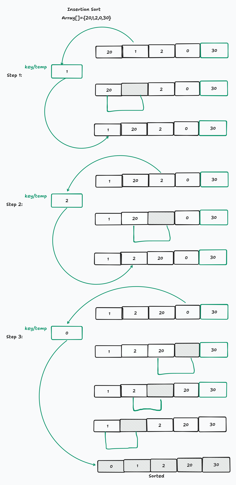

**PSEUDOCODE PROGRAM**

~~~
 // Algoritma Insertion Sort dimulai
    FOR i FROM 1 TO jumlah - 1
        // Simpan elemen array saat ini dalam variabel sementara
        SET temp = array[i]
        
        // Atur indeks j ke elemen sebelum elemen saat ini
        SET j = i - 1
        
        // Pindahkan elemen array yang lebih besar dari temp ke posisi berikutnya
        WHILE j >= 0 AND array[j] > temp
            // Memindahkan elemen array ke posisi berikutnya
            array[j + 1] = array[j]
            
            // Mengurangi nilai j
            DECREMENT j
        END WHILE
        
        // Menempatkan temp di posisi yang tepat
        array[j + 1] = temp
    END FOR
~~~

**Penjelasan Komentar pada Pseudocode**

1. Algoritma Insertion Sort dimulai:

   - Menggunakan loop FOR untuk iterasi dari elemen kedua (indeks 1) hingga elemen terakhir array.

2. Simpan elemen array saat ini dalam variabel sementara:
   - Menyimpan elemen saat ini ke dalam variabel temp untuk dibandingkan dan ditempatkan di posisi yang benar.

3. Atur indeks j ke elemen sebelum elemen saat ini:
   - Mengatur indeks j ke elemen yang ada sebelum elemen saat ini untuk membandingkan dan menggeser elemen jika diperlukan.

4. Pindahkan elemen array yang lebih besar dari temp ke posisi berikutnya:
   - Menggunakan loop WHILE untuk menggeser elemen yang lebih besar dari temp ke posisi berikutnya hingga menemukan posisi yang tepat untuk temp.

5. Memindahkan elemen array ke posisi berikutnya:
   - Menggeser elemen di indeks j ke indeks j + 1.

6. Mengurangi nilai j:
   - Mengurangi nilai j untuk memeriksa elemen sebelumnya dalam array.

7. Menempatkan temp di posisi yang tepat:
   - Menempatkan temp di posisi yang benar setelah semua elemen yang lebih besar darinya telah digeser.

**Contoh Algoritma Insertion Sort**

~~~
Array[]={5, 2, 4, 6, 1, 3}
~~~

**Langkah 1: Elemen Pertama**

  - i = 1, elemen kedua (array[1] = 2).
  - Bandingkan 2 dengan elemen sebelumnya (5).
  - Karena 2 lebih kecil dari 5, geser 5 ke kanan.
  - Tempatkan 2 di posisi yang benar.

Array setelah langkah ini:
~~~
{2, 5, 4, 6, 1, 3}
~~~
**Langkah 2: Elemen Kedua**

  - i = 2, elemen ketiga (array[2] = 4).
  - Bandingkan 4 dengan elemen sebelumnya (5).
  - Karena 4 lebih kecil dari 5, geser 5 ke kanan.
  - Tempatkan 4 di posisi yang benar.

Array setelah langkah ini:

~~~
{2, 4, 5, 6, 1, 3}
~~~

**Langkah 3: Elemen Ketiga**

  - i = 3, elemen keempat (array[3] = 6).
  - Bandingkan 6 dengan elemen sebelumnya (5).
  - Karena 6 lebih besar dari 5, tidak perlu menggeser elemen.
  - 6 sudah di posisi yang benar.

Array setelah langkah ini:

~~~
{2, 4, 5, 6, 1, 3}
~~~

**Langkah 4: Elemen Keempat**
  - i = 4, elemen kelima (array[4] = 1).
  - Bandingkan 1 dengan elemen sebelumnya (6), geser 6 ke kanan.
  - Bandingkan 1 dengan elemen sebelumnya (5), geser 5 ke kanan.
  - Bandingkan 1 dengan elemen sebelumnya (4), geser 4 ke kanan.
  - Bandingkan 1 dengan elemen sebelumnya (2), geser 2 ke kanan.
  - Tempatkan 1 di posisi yang benar.

Array setelah langkah ini:

~~~
[1, 2, 4, 5, 6, 3]
~~~

**Langkah 5: Elemen Kelima**

  - i = 5, elemen keenam (array[5] = 3).
  - Bandingkan 3 dengan elemen sebelumnya (6), geser 6 ke kanan.
  - Bandingkan 3 dengan elemen sebelumnya (5), geser 5 ke kanan.
  - Bandingkan 3 dengan elemen sebelumnya (4), geser 4 ke kanan.
  - Tempatkan 3 di posisi yang benar.

Array setelah langkah ini:

~~~
{1, 2, 3, 4, 5, 6}
~~~

**Gambar Ilustrasi Algoritma InsertionSort**

