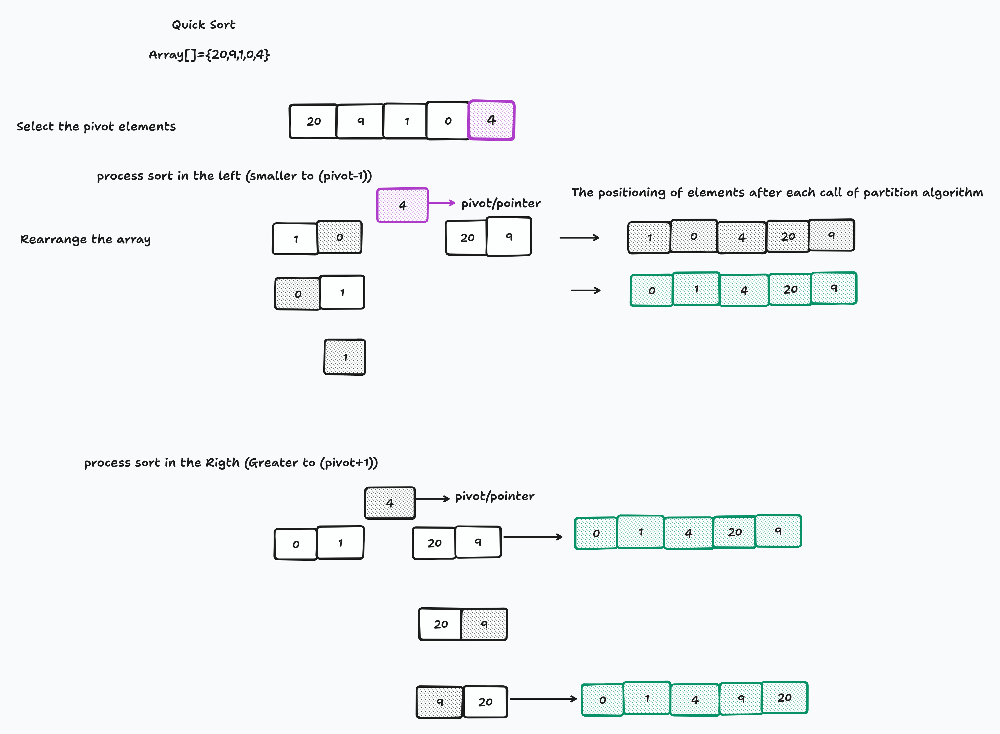

**Pseudocode**
~~~
QuickSort(arr, low, high)
    if low < high then
        // Partisi array dan dapatkan indeks pivot
        pivotIndex = Partition(arr, low, high)
        // Panggil QuickSort pada bagian kiri dari pivot
        QuickSort(arr, low, pivotIndex - 1)
        // Panggil QuickSort pada bagian kanan dari pivot
        QuickSort(arr, pivotIndex + 1, high)
    endif
end QuickSort

Partition(arr, low, high)
    // Pilih elemen terakhir sebagai pivot
    pivot = arr[high]
    // Inisialisasi indeks elemen yang lebih kecil dari pivot
    i = low - 1
    // Iterasi untuk memindahkan elemen yang lebih kecil dari pivot ke bagian kiri array
    for j from low to high - 1 do
        if arr[j] < pivot then
            i = i + 1
            // Tukar elemen di i dengan elemen di j
            Swap(arr, i, j)
        endif
    endfor
    // Tempatkan pivot di posisi yang benar
    Swap(arr, i + 1, high)
    // Kembalikan indeks pivot
    return i + 1
end Partition

//Pertukaran array
Swap(arr, a, b)
    temp = arr[a]
    arr[a] = arr[b]
    arr[b] = temp
end Swap

~~~

**Langkah-langkah Algoritma QuickSort**

~~~
Array awal: [7, 2, 1, 6, 8, 5, 3, 4]
~~~
**Langkah 1: Pilih Pivot**

Pivot yang dipilih bisa bervariasi. Misalnya, kita pilih elemen terakhir sebagai pivot. Dalam contoh ini, pivotnya adalah 4.

**Langkah 2: Partisi Array**

Kita partisi array menjadi dua bagian: elemen-elemen yang lebih kecil dari pivot (partisi kiri) dan elemen-elemen yang lebih besar dari pivot (partisi kanan). Setelah partisi, array akan terlihat seperti ini:

~~~
[2, 1, 3, 4, 8, 5, 7, 6]
~~~

**Langkah 3: Rekursi**

Kemudian, kita rekursif melakukan QuickSort pada kedua bagian array tersebut.

 - Bagian Kiri: [2, 1, 3]
   - Pivot: 1 (elemen terakhir)
   - Setelah partisi: [1, 2, 3] (tidak ada perubahan karena sudah terurut)

 - Bagian Kanan: [8, 5, 7, 6]
   - Pivot: 6 (elemen terakhir)
   - Setelah partisi: [5, 6, 7, 8] (tidak ada perubahan karena sudah terurut)

**Langkah 4: Gabungkan**

Ketika kedua bagian sudah terurut, kita gabungkan kembali array tersebut dengan memasukkan pivot di antara kedua bagian yang telah terurut. Hasil akhir setelah penggabungan adalah:

~~~
[1, 2, 3, 4, 5, 6, 7, 8]
~~~

**Gambar Ilustrasi Algoritma QuickSort**
