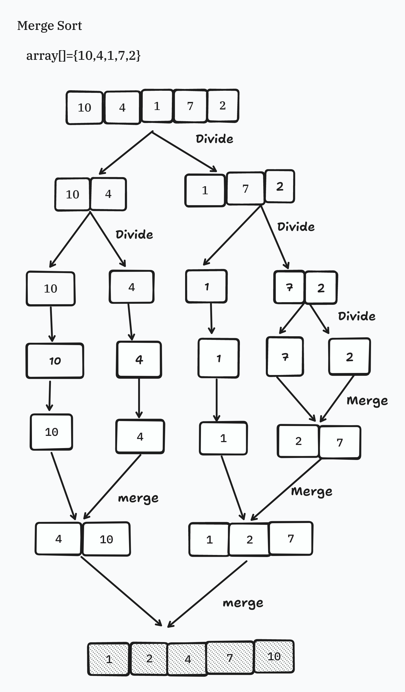

**# Di dalam workspace ini berisi materi sorting program seperti:**

**## 1. Bubble Sort**
**### a. Pengertian**
      Bubble Sort adalah algoritma pengurutan yang sederhana. Algoritma ini bekerja dengan cara membandingkan setiap pasangan elemen yang berdekatan dan menukarnya jika mereka berada dalam urutan yang salah. Proses ini diulang terus-menerus sampai tidak ada lagi elemen yang perlu ditukar.
   
**### b. Kelebihan**
   - Mudah dipahami dan diimplementasikan.
   - Bagus untuk dataset kecil yang hampir terurut.

**### c. Kelemahan**
   - Tidak efisien untuk dataset besar karena waktu komputasinya O(n^2).
   - Banyak pertukaran yang terjadi sehingga tidak optimal untuk banyak data.

**### d. Contoh Kehidupan Sehari-hari**
   - Mengurutkan nilai siswa dalam satu kelas.
   - Mengurutkan daftar nama dalam buku tamu.

**### e. Langkah-langkah**
   - Bandingkan elemen pertama dan kedua, tukar jika elemen pertama lebih besar.
   - Pindah ke pasangan elemen berikutnya dan ulangi langkah pertama.
   - Teruskan proses ini sampai elemen terakhir, sehingga elemen terbesar 'menggelembung' ke posisi terakhir.
   - Ulangi proses untuk sisa elemen sampai tidak ada lagi yang perlu ditukar.
**### f. Gambaran Algoritma Bubble**

**## 2. Selection Sort**
**### a. Pengertian**
      Selection Sort adalah algoritma pengurutan yang bekerja dengan cara memilih elemen terkecil dari bagian yang tidak terurut dan menukarnya dengan elemen pertama dari bagian yang tidak terurut tersebut.

**### b. Kelebihan**
   - Mudah dipahami dan diimplementasikan.
   - Mengurangi jumlah pertukaran dibandingkan dengan Bubble Sort.

**### c. Kelemahan**
   - Tidak efisien untuk dataset besar karena memiliki waktu eksekusi O(n²).
   - Tidak adaptif, artinya tidak mengubah urutan jika elemen sudah hampir terurut.

**### d. Contoh Aplikasi**
   - Mengurutkan skor ujian dari yang terkecil hingga terbesar.
   - Menyusun daftar harga produk dari yang termurah.

**### e. Langkah-langkah**
   - Temukan elemen terkecil di array.
   - Tukar elemen terkecil dengan elemen pertama.
   - Pindah ke elemen kedua dan ulangi langkah pertama untuk sisa array.
   - Ulangi proses ini sampai semua elemen terurut.
**### f. Gambaran Algoritma Selection**

**## 3. Insertion Sort**
**### a. Pengertian**
      Insertion Sort adalah algoritma pengurutan yang membangun array terurut satu per satu dengan mengambil elemen dari array yang tidak terurut dan menempatkannya pada posisi yang tepat dalam array terurut.

**### b. Kelebihan**
   - Efisien untuk dataset kecil dan hampir terurut.
   - Adaptif: bekerja lebih baik pada data yang sebagian besar sudah terurut.

**### c. Kelemahan**
   - Tidak efisien untuk dataset besar dengan waktu eksekusi O(n²).
   - Banyak pergeseran elemen yang dilakukan.

**### d. Contoh Aplikasi**
   - Mengurutkan kartu dalam permainan kartu.
   - Mengurutkan daftar tugas berdasarkan prioritas.

**### e. Langkah-langkah**
   - Mulai dari elemen kedua, bandingkan dengan elemen sebelumnya.
   - Geser elemen sebelumnya ke kanan jika lebih besar dari elemen yang diambil.
   - Tempatkan elemen yang diambil di posisi yang sesuai.
   - Ulangi langkah ini untuk semua elemen dalam array.

**## 4. Merge Sort**

**### a. Pengertian**
      Merge Sort adalah algoritma pengurutan berbasis divide-and-conquer yang membagi array menjadi dua bagian, mengurutkan masing-masing bagian, dan kemudian menggabungkannya kembali dalam urutan yang benar.

**### b. Kelebihan**
   - Efisien untuk dataset besar dengan waktu eksekusi O(n log n).
   - Stabil, artinya tidak mengubah urutan relatif dari elemen yang sama.

**### c. Kelemahan**
   - Membutuhkan ruang tambahan untuk array sementara.
   - Implementasi lebih kompleks dibandingkan algoritma sederhana seperti Bubble Sort.

**### d. Contoh Aplikasi**
   - Mengurutkan data besar seperti catatan penjualan dalam database.
   - Menggabungkan dua daftar email yang terurut.

**### e. Langkah-langkah**
   - Bagi array menjadi dua bagian yang sama.
   - Urutkan masing-masing bagian menggunakan Merge Sort secara rekursif.
   - Gabungkan dua bagian yang terurut menjadi satu array yang terurut.
**### f. Gambaran Algoritma Merge**

**## 5. Quick Sort**
**### a. Pengertian**
      Quick Sort adalah algoritma pengurutan berbasis divide-and-conquer yang memilih sebuah elemen sebagai pivot dan mengatur elemen lainnya ke dalam dua subarray, satu dengan elemen yang lebih kecil dan satu dengan elemen yang lebih besar dari pivot.

**### b. Kelebihan**
   - Sangat efisien dengan waktu eksekusi rata-rata O(n log n).
   - Tidak membutuhkan ruang tambahan yang signifikan.

**### c. Kelemahan**
   - Kinerja buruk pada dataset yang sudah terurut atau hampir terurut (bisa mencapai O(n²)).
   - Memilih pivot yang buruk dapat mempengaruhi performa.

**### d. Contoh Aplikasi**
   - Mengurutkan data besar seperti catatan transaksi di sistem perbankan.
   - Mengurutkan daftar produk berdasarkan penjualan di e-commerce.

**### e. Langkah-langkah**
   - Pilih pivot dari array.
   - Partisi array sehingga elemen lebih kecil dari pivot berada di kiri dan yang lebih besar di kanan.
   - Urutkan bagian kiri dan kanan menggunakan Quick Sort secara rekursif.
   - Gabungkan bagian yang terurut.

